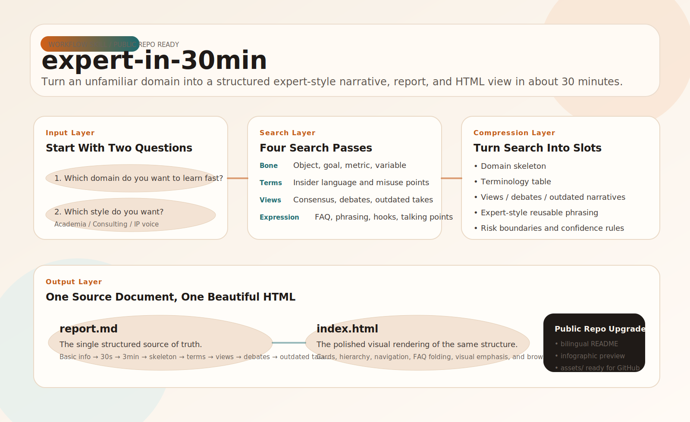

# expert-in-30min

> Build a credible domain-expert communication frame in about 30 minutes.

[中文说明](./README.zh.md)



## What It Is

`expert-in-30min` is a workflow-style skill for rapidly turning an unfamiliar topic into a structured expert-style output package.

It is built for scenarios such as:

- preparing a talk, livestream, workshop, or podcast
- drafting a course outline, consulting brief, or sales narrative
- turning scattered research into a strong point of view
- generating a structured report and a corresponding HTML presentation

## What It Produces

By default, the skill produces two aligned outputs:

1. `report.md` — the single structured source document
2. `index.html` — a polished visual rendering of the same structure

These outputs map section-to-section. The HTML is not a second content system; it is the visual layer of the same document.

## Typical Use Cases

- Content creation for articles, videos, podcasts, and livestreams
- Course packaging and consulting-style offer design
- Fast orientation in a new industry or technical topic
- Talk, workshop, and internal briefing preparation
- Sales communication for complex topics
- IP positioning for “insightful expert” style content
- Structured mini knowledge packs with matching HTML presentation

## Input Flow

The skill starts by asking two questions:

1. What domain do you want to learn fast?
2. Which output style do you want?
   - `学院派`
   - `咨询派`
   - `IP派`

## Core Structure

```text
expert-in-30min/
├── SKILL.md
├── Spec-expert-in-30min.md
├── README.md
├── README.zh.md
├── assets/
│   └── images/
├── references/
└── scripts/
```

## Typical Sections In Output

- Basic info
- 30-second explanation
- 3-minute explanation
- Domain skeleton
- Terminology
- Mainstream views
- Core debates
- Outdated narratives
- Reusable expert-style talking points
- FAQ
- Risk boundaries
- Action suggestions

## Why It Exists

Most people do not fail because they cannot find information. They fail because they cannot compress it into a usable structure, a confident narrative, and a repeatable format.

This skill is designed to solve that exact gap.

## Files

- `SKILL.md`: the runnable entry and execution rules
- `Spec-expert-in-30min.md`: product and workflow design spec
- `references/`: supporting rules for output modes, packaging, search, and guardrails
- `scripts/`: helper scripts such as opening the generated HTML
- `assets/images/`: public-facing diagrams and visual aids for the repo

## Notes

- This skill is for structured understanding and communication speed, not regulated professional substitution.
- High-risk areas such as law, medicine, and finance still require domain-specific validation.
